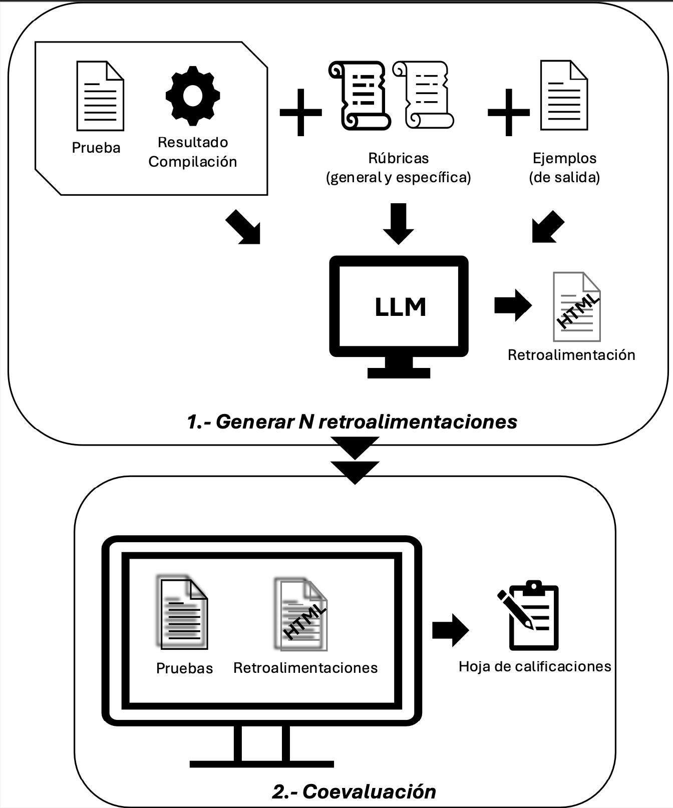

# LLMCoevaluator

## Introducción

Este repositorio acompaña al artículo **“Coevaluando con LLM: generando una retroalimentación formativa a tiempo”** enviado a las *XXXI Jornadas sobre la Enseñanza Universitaria de la Informática (JENUI 2025)*, en el que se propone una metodología de coevaluación entre docente e inteligencia artificial para asignaturas de programación. 

La retroalimentación formativa es una herramienta pedagógica clave para fomentar la reflexión y el aprendizaje significativo. Sin embargo, proporcionar comentarios detallados y a tiempo en contextos con muchos estudiantes supone una carga excesiva para el profesorado. 

Para abordar este problema, se plantea una solución basada en **Modelos de Lenguaje de Gran Tamaño (LLM)** que actúan como evaluadores automáticos preliminares. Estos modelos generan una evaluación inicial del código del estudiante, que luego es revisada y ajustada por el docente. De esta forma, se reduce el tiempo necesario para ofrecer retroalimentación útil sin comprometer la calidad ni la fiabilidad del proceso.  Se ha de mencionar que la evaluación automática sin supervisión es una práctica clasificada como de alto riesgo si se usa para calificar estudiantes (Ley de IA UE 2024/1689), pero deja de serlo al ser supervisada y modificada por el docente.

Este repositorio contiene el código necesario para realizar esta coevaluación en dos fases:

1. Generación automática de retroalimentación usando LLM.
2. Revisión y ajuste por parte del docente para su entrega final en la plataforma Moodle.

<p align="center">
    
</p>

<p align="center">
    <em>Figura 1: Sistema propuesto para coevaluación con LLM.</em>
</p>

---

# Paso 1: Instalación y configuración

Se incluye un archivo `requirements.txt` para facilitar la instalación de las dependencias necesarias en un nuevo entorno python que crees. Se recomienda crearlo en esta misma carpeta.
## Crear un entorno Python

Para aislar las dependencias y facilitar la instalación, se recomienda crear un entorno virtual de Python. A continuación se indican los pasos para los principales sistemas operativos:

### Windows

```sh
python -m venv venv
venv\Scripts\activate
pip install -r requirements.txt
```

### macOS / Linux

```sh
python3 -m venv venv
source venv/bin/activate
pip install -r requirements.txt
```

Una vez activado el entorno, todas las dependencias se instalarán localmente y no afectarán a otros proyectos.

Además, es necesario completar las API Keys en el archivo `.env`. Este archivo ya está preparado para incluir claves de acceso a modelos de OpenAI y Anthropic. Todo el sistema está diseñado para tener esta carpeta en la raíz del proyecto.

---

# Paso 2: Evaluación automática con LLM

Actualmente se soportan dos lenguajes: **C (con GCC)** y **Java (con Maven)**. Esto sólo es necesario para compilar el código y es un paso que se podría saltar si es necesario. 

## Evaluación en Java

En la carpeta `Java/` se incluye el fichero `Paso1_EvaluadorLocalJava.ipynb` para uso en local conectándose a las API de pago del proveedor que se configure. Se facilita el código para conectarse a OpenAI y Anthrophic.

Dentro de esta carpeta se encuentra un directorio `EspacioTrabajo` con un proyecto base.

El evaluador espera encontrar en la carpeta `pruebas` una carpeta por cada estudiante con una jerarquía de carpetas y archivos `*.java` que copiaran uno a uno al espacio de trabajo para compilar y ver que funciona correctamente. Un ejemplo de sistema de carpetas que se espera dentro de pruebas:
```plaintext
EspacioTrabajo/
pruebas/
├── estudiante1/
│   └── SplayTree.java
├── estudiante2/
│   └── SplayTree.java
├── estudiante3/
│   └── SplayTree.java
└── Calificaciones.csv
```

Aunque se comprueba si el código compila, **la salida del compilador no se incluye en el prompt del LLM**, ya que no se ha observado un impacto positivo al hacerlo.

El código del estudiante, junto con una rúbrica (general y específica) y un ejemplo de salida esperado, se introduce en el prompt para que el LLM genere la retroalimentación.

## Evaluación en C

El procedimiento es análogo al de Java.

En la carpeta `C/` se incluye el `Paso1_EvaluadorLocalC.ipynb`.

Se incluye un ejemplo de proyecto y pruebas en las subcarpetas `EspacioTrabajo/` y `pruebas/`.

Los evaluadores recorren archivos `*.c`, integran el código, compilan y formulan una petición al LLM con el prompt adecuado (rúbricas, código y resultado de la compilación).

---

## Coevaluación 
El directorio `Coevaluador/` contiene el código necesario para la segunda fase del proceso: la revisión y ajuste de la retroalimentación generada automáticamente por el LLM. El objetivo es facilitar al docente la edición, validación y personalización de los comentarios antes de subirlos a Moodle.

Antes de ejecutar la aplicación, es importante configurar algunos parámetros en el archivo `app.py` para que el sistema funcione correctamente con tus datos. En concreto, debes revisar y ajustar las siguientes variables al inicio del archivo:

```python
FICHERO_CORRECCIONES = "../Java/pruebas/Calificaciones.csv"  # Ruta al archivo CSV de calificaciones exportado desde Moodle
LENGUAJE = ".java"                           # Extensión de los archivos de código a evaluar (por ejemplo, ".java" o ".c")
CARPETA_BASE = "../Java/pruebas/"            # Carpeta donde se encuentran los directorios de cada estudiante con sus archivos de código
```

Asegúrate de que las rutas y extensiones coincidan con la organización de tus archivos y el lenguaje de programación que estés utilizando.

### Ejecución

Para iniciar la aplicación de coevaluación, ejecuta el archivo `app.py` que se encuentra en la carpeta `Coevaluador`:

```sh
python Coevaluador/app.py
```

La aplicación de coevaluación está desarrollada con **Flask**, un microframework web para Python. Flask permite crear aplicaciones web de forma sencilla y flexible, facilitando la construcción de interfaces interactivas para la revisión y ajuste de la retroalimentación. Gracias a Flask, la herramienta ofrece una interfaz accesible desde el navegador, donde el docente puede gestionar los comentarios generados por el LLM antes de exportarlos a Moodle.

Por defecto, la aplicación se ejecuta en [http://127.0.0.1:5000](http://127.0.0.1:5000). Puedes acceder a la interfaz abriendo esta URL en tu navegador tras iniciar el servidor.

### ¿Cómo funciona?

1. **Carga de resultados automáticos:** El coevaluador importa los archivos de retroalimentación generados por el LLM para cada estudiante. Requiere el fichero CSV de las calificaciones de la tarea que se descarga automáticamente en moodle.
2. **Interfaz de revisión:** Proporciona una interfaz (notebook o script interactivo) donde el docente puede revisar, modificar y aprobar los comentarios propuestos.
3. **Exportación para Moodle:** Cuando se van realizando las revisiones y actualizando las notas, el fichero Calificaciones.csv también se modifica. Cuando se termina, este fichero se puede importar en la misma tarea en moodle para acualizar la nota y comentarios a los estudiantes.


---

# Licencia y contacto

Este trabajo ha sido desarrollado en la Universidad de Málaga por:

- Joaquín Ballesteros ([jballesteros@uma.es](mailto:jballesteros@uma.es))  [ITIS Software — Grupo CAOSD](https://itis.uma.es) .

En colaboración con: 
- Pablo Franco ([pablo.franco@uma.es](mailto:pablo.franco@uma.es)) [Métodos de Investigación y Diagnóstico en Educación](https://www.uma.es/departamento-de-teoria-e-historia-de-la-educacion/)
- Lidia Fuentes ([lfuentes@uma.es](mailto:lfuentes@uma.es)) [ITIS Software — Grupo CAOSD](https://itis.uma.es) .


Si usas este código o metodología en tu investigación o docencia, te invitamos a citar el artículo asociado.

---

